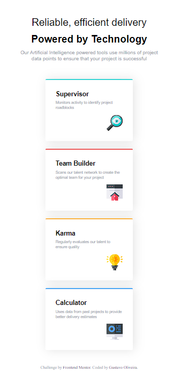

## Index

    - [The challenge](#the-challenge)
    - [Screenshot](#screenshot)
    - [Links](#links)
    - [Built with](#built with)
    - [Author](#author)

### The challenge

Users must be able to:

- See the optimal layout for the website depending on the device screen size

### Print Screen

### Links

- Live Website URL: (https://guhh18.github.io/four-card-feature-section/)

### Built with

- Semantic HTML5 markup
- Custom CSS properties
- Flexbox

## Author

- Github- [Gustavo Oliveira](https://github.com/Guhh18)
- Mentor Frontend - [@Guhh18](https://www.frontendmentor.io/profile/Guhh18)